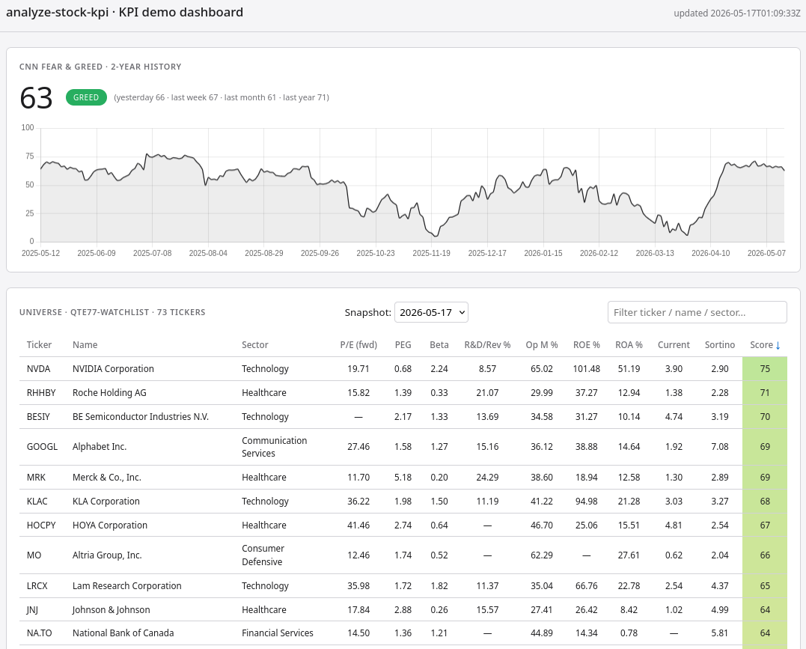

# analyze-stock-kpi

[](https://github.com/qte77/analyze-stock-kpi/blob/main/CHANGELOG.md)
[](https://github.com/qte77/analyze-stock-kpi/actions/workflows/validate.yaml)
[](https://github.com/qte77/analyze-stock-kpi/actions/workflows/links-fail-fast.yaml)
[](https://www.codefactor.io/repository/github/qte77/analyze-stock-kpi)
[](https://github.com/qte77/analyze-stock-kpi/actions/workflows/codeql.yaml)
[](https://github.com/qte77/analyze-stock-kpi/actions/workflows/sbom.yaml)
[](https://qte77.github.io/analyze-stock-kpi/)

Library-based stock KPI CLI: per-ticker fundamentals via yfinance plus a
daily CNN Fear & Greed sentiment snapshot. No API keys, no scraping.

**Live demo**: [qte77.github.io/analyze-stock-kpi/](https://qte77.github.io/analyze-stock-kpi/) — weekly `qte77-watchlist` snapshot + rolling F&G history.

<details>
<summary>Dashboard screenshot · click to expand</summary>



</details>

## Quickstart

```bash
make setup_dev                              # uv sync (default groups: dev + test)
make run UNIVERSE=qte77-watchlist           # fetch fundamentals -> results/fundamentals_<UTC>.json
make run TICKERS=AAPL,MSFT                  # ad-hoc ticker list
make run TICKERS=AAPL SHOW_SCORES=1         # also append composite-score columns
make help                                   # list available recipes
make validate                               # lint + types + complexity + md + tests
```

CLI args double as env vars with the `SSK_` prefix
(e.g. `SSK_TICKERS=AAPL,MSFT`).

## What it produces

* **Fundamentals** — `results/fundamentals_<UTC>.json`: one
  `FundamentalsSnapshot` per resolved ticker (~34 yfinance fields,
  including the computed `roi`, `rd_to_revenue`, `sortino_ratio`
  enrichments) plus seven 0-100 composite proxy scores (Quality /
  Dividend / Growth / Big Call / AAQS / HGI / Screener). Sparse
  fields for non-equities (FX, futures, crypto) are valid by design.
* **Sentiment** — `results/cnn_fg/YYYY.json`: per-year date-sorted
  array of CNN Fear & Greed snapshots (headline + 9 subindicators).
  Updated daily by a GitHub Actions cron at 21:30 UTC.

## Sample output

`make run TICKERS=AAPL` prints a CNN Fear & Greed banner, then a
13-column rich summary table:

> Ticker · Name · Sector · P/E (fwd) · PEG · Beta · R&D/Rev % ·
> Op M % · ROE % · ROA % · Current · Sortino · Score

With `--show-scores`, three legacy composite columns (Quality · Div ·
Growth) are appended. The [live demo dashboard][demo] renders the same
column set with row-click → KPI detail panel + sortable headers — see
the screenshot near the top of this README.

[demo]: https://qte77.github.io/analyze-stock-kpi/

The persisted JSON `results/fundamentals_<UTC>.json` is one
`FundamentalsSnapshot` per ticker with a nested `composite_scores`
block. All numeric fields are `float | null` so sparse non-equities
(FX, futures, crypto) are valid:

```json
{
  "symbol": "AAPL",
  "long_name": "Apple Inc.",
  "sector": "Technology",
  "market_cap": ...,
  "trailing_pe": ..., "forward_pe": ..., "price_to_book": ..., "trailing_peg_ratio": ...,
  "return_on_equity": ..., "return_on_assets": ..., "operating_margins": ...,
  "debt_to_equity": ..., "current_ratio": ..., "quick_ratio": ...,
  "revenue_growth": ..., "earnings_growth": ...,
  "dividend_yield": ..., "payout_ratio": ...,
  "beta": ..., "roi": ..., "rd_to_revenue": ..., "sortino_ratio": ...,
  "composite_scores": {
    "quality": ..., "dividend": ..., "growth": ..., "big_call": ...,
    "aaqs": ..., "hgi": ..., "screener_score": ...
  }
}
```

`dividend_yield` is stored as a fraction; the
`_normalize_yfinance_info` helper divides yfinance's current
percentage-shaped value (e.g. `0.37`) at the fetch boundary. Full
field list in [`src/fundamentals.py`](src/fundamentals.py); composite
formulas in [`src/composite_scores.py`](src/composite_scores.py).

## Universe sources

In priority order:

| Source | Example |
|---|---|
| Inline list | `TICKERS=AAPL,MSFT` |
| File (one symbol per line) | `TICKERS_FILE=path/to/list.txt` |
| Preset | `UNIVERSE=qte77-watchlist` (or `crypto-top10` — see [`src/assets/universes/`](src/assets/universes) for all available presets) |

## Documentation

* [`docs/architecture.md`](docs/architecture.md) — module map + data flow
* [`docs/UserStory.md`](docs/UserStory.md) — product intent + non-goals
* [`docs/roadmap.md`](docs/roadmap.md) — milestones + tracked issues
* [`docs/demo/`](docs/demo) — static dashboard sources (deployed to GitHub Pages); preview locally with `make preview` (serves on `:8000`, data fetched cross-origin from the `data` branch)
* [`docs/decisions/`](docs/decisions) — ADRs (Traderfox removal,
  `financetoolkit` deferral, simplified composites, RS hedging deferral)
* [`docs/cnn-fg-api.md`](docs/cnn-fg-api.md) — CNN F&G endpoint schema
* [`CHANGELOG.md`](CHANGELOG.md) — release history + known issues
* [`AGENTS.md`](AGENTS.md) — agent collaboration rules

## License

[Apache 2.0](LICENSE)
